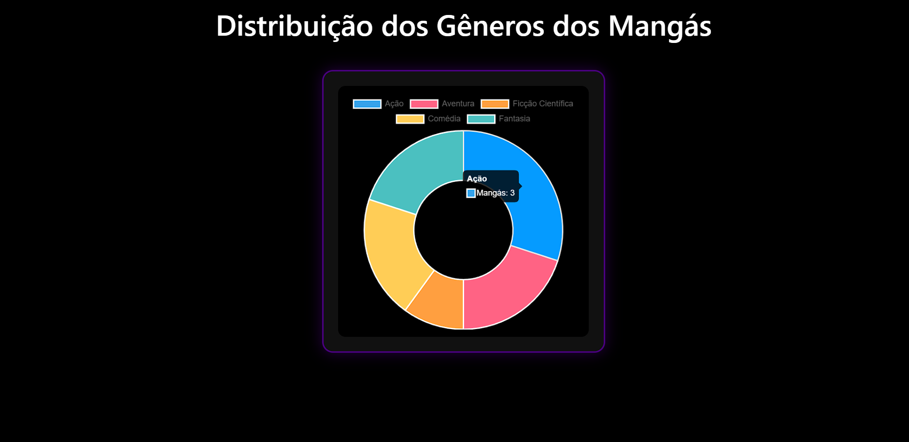

# Trabalho Prático - Semana 14

A partir dos dados disponíveis em seu projeto, vamos explorar formas de visualização que permitam apresentar essas informações de maneira clara, interativa e significativa. Você poderá utilizar gráficos (barras, linhas, pizza), mapas, calendários ou outras formas de visualização. Seu desafio é desenvolver uma página Web capaz de organizar, processar e exibir os dados de forma compreensível e visualmente atraente.

Com base no tipo de projeto escolhido, você deverá propor **visualizações que estimulem a interpretação, o agrupamento e a apresentação criativa dos dados**, trabalhando tanto os aspectos lógicos quanto os visuais da aplicação.

Sugerimos o uso das seguintes ferramentas acessíveis: [FullCalendar](https://fullcalendar.io/), [Chart.js](https://www.chartjs.org/), [Mapbox](https://docs.mapbox.com/api/), para citar algumas.

## Informações Gerais

- Nome: Gabriel Henrique Santos de Assis
- Matrícula: 926438
- Proposta de projeto escolhida: Página sobre alguns mangás
- Breve descrição sobre seu projeto: Página contendo algumas informações sobre mangás.

**Print da tela com a implementação**

<< Coloque aqui uma breve explicação da implementação feita nesta etapa>>
- Gráfico sobre os gêneros dos mangas que estão na página

<<  COLOQUE A IMAGEM DA TELA 1 AQUI >>

<<  COLOQUE A IMAGEM DA TELA 2 AQUI >>
